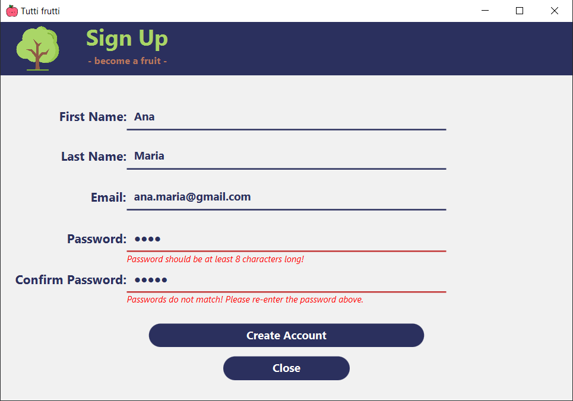
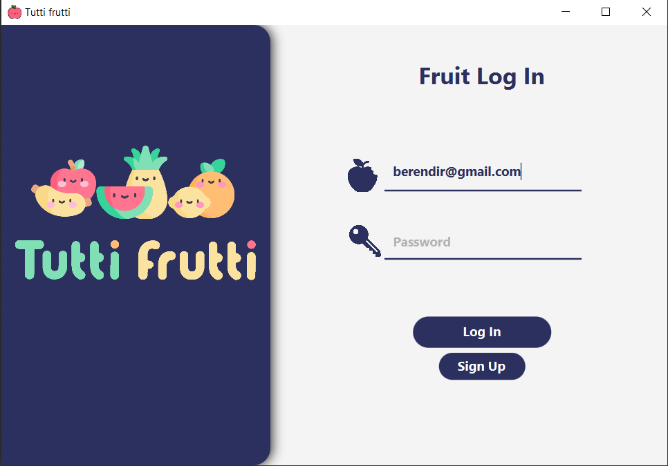
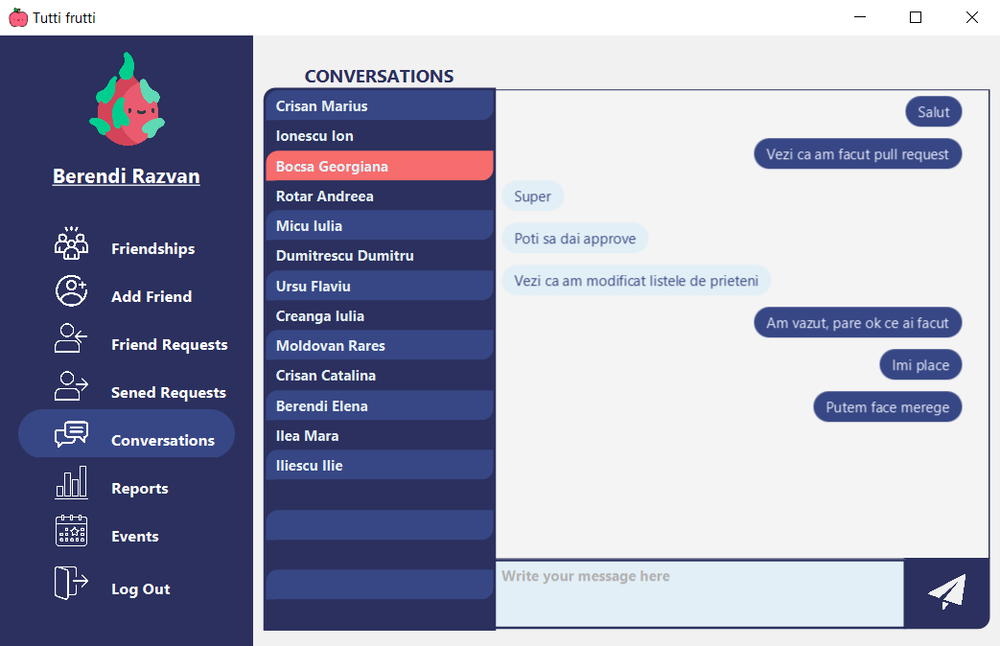
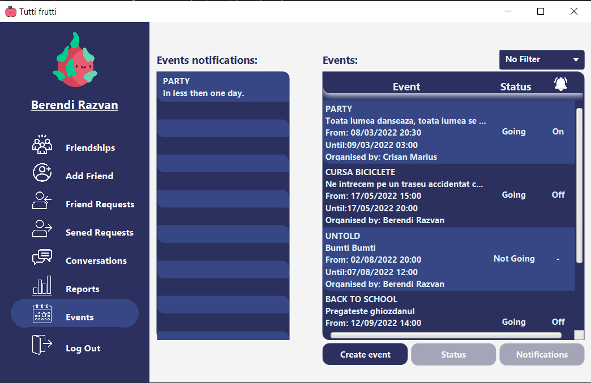
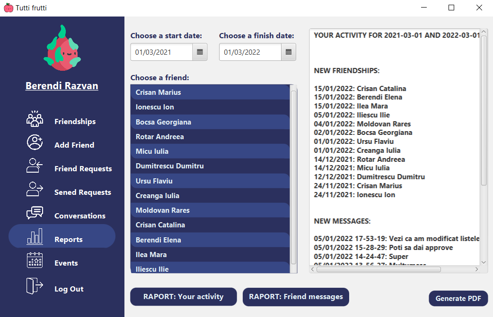

# Java-Project-MAP---Social-Network-TuttiFrutti
Aceasta este o aplicație pentru o rețea de socializare, realizată în echipă, folosind Java, SceneBuilder (JavaFx) și o bază de date pgAdmin. În aplicație puteți să vă creați un cont, iar apoi vă puteți autentifica pentru a vă face prieteni și a vorbi cu ei în chat-ul aplicației. De asemenea puteți crea și participa la diferite evenimente din rețeaua de socializare.

Dacă nu ai cont în aplicație, îți poți crea unul:

Te poți autentifica în contul tău personal:

După ce îți faci prieteni în rețeaua de socializare, poți comunica cu ei în chat:

Dar în același timp poți crea sau participa la diferite evenimente din aplicație:

Iar la finalul zilei poți vedea un raport cu istoricul activității tale în aplicație și dacă vrei poți genera un fișier pdf cu acesta:

